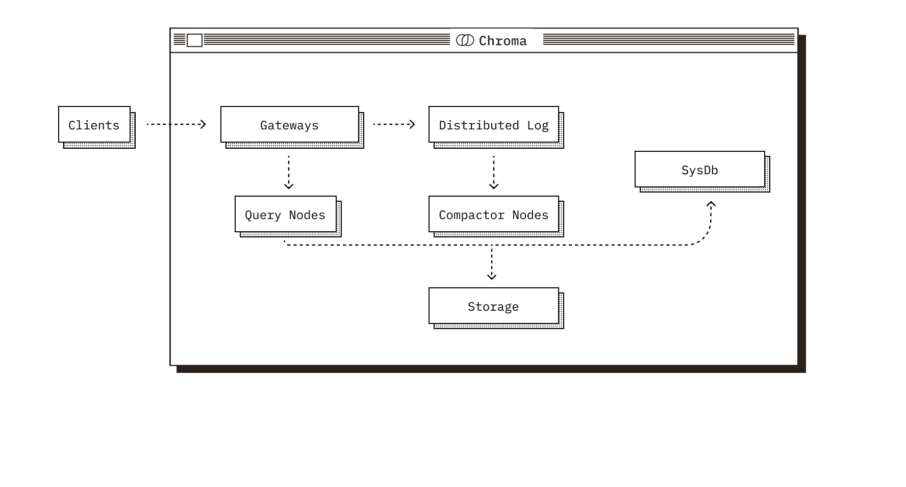
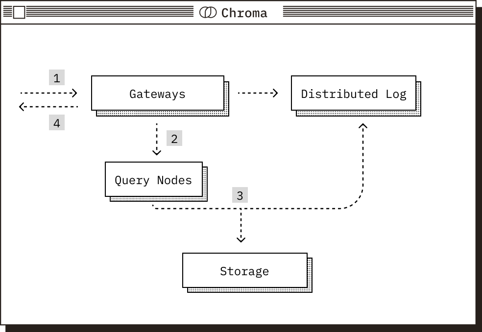
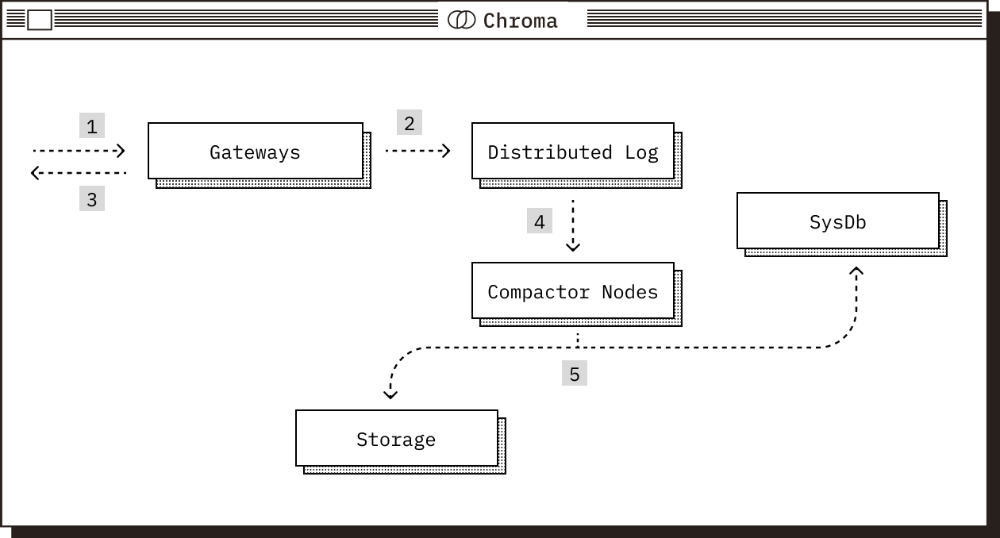

---

title: Chroma 向量数据库

publishDate: 2025-07-10 13:50:00

description: '开源轻量级的 ai 原生向量数据库，简单易上手，适合原型开发'

tags:

 - vector database
 - chroma

heroImage: { src: '../../thumbnails/blackdaisy.png', color: '#1b1c1c' }

language: '中文'
---

> 本篇文章内容来源于[Chroma官方文档](https://docs.trychroma.com/docs/overview/introduction)，是学习过程中的翻译整理，仅作参考。

Chroma 是开源 AI 应用数据库，支持多种部署方式（后面会介绍），当使用客户端-服务端模式部署时，官方提供了 python 和 JavaScript/Typescript 两种客户端 sdk，并且支持在 Jupyter Notebook 中运行。

## 快速入门

### 安装

```python
pip install chromadb
```

### 创建客户端

```python
import chromadb
chroma_client = chromadb.Client()
```

### 创建集合

集合用于存储嵌入、文档以及其他元数据，集合会为你的嵌入和文档建立索引，并支持高效的检索和筛选。

```python
collection = chroma_client.create_collection(name="my_collection")
```

### 添加文本数据

Chroma 将存储你的文本并**自动处理嵌入和索引**，你还可以自定义嵌入函数，这里使用默认嵌入函数，你必须为文本提供唯一的字符串 id。

```python
collection.add(
    ids=["id1", "id2"],
    documents=[
        "This is a document about pineapple",
        "This is a document about oranges"
    ]
)
```

### 查询集合

你可以使用查询文本列表来查询集合，Chroma 将返回 n 个最相似的结果，n 默认是 10，这里设置为 2。

```python
results = collection.query(
    query_texts=["This is a query document about hawaii"], # Chroma will embed this for you
    n_results=2 # how many results to return
)
print(results)
```

### 检查结果

从输出可以看到，我们关于夏威夷的查询在语义上与关于菠萝的文档最相似。

```python
{
  'documents': [[
      'This is a document about pineapple',
      'This is a document about oranges'
  ]],
  'ids': [['id1', 'id2']],
  'distances': [[1.0404009819030762, 1.243080496788025]],
  'uris': None,
  'data': None,
  'metadatas': [[None, None]],
  'embeddings': None,
}
```

### 亲自试一下

如果我们试着用 "This is a query document about florida" 来查询呢？下面是一个完整的例子。

```python
import chromadb
chroma_client = chromadb.Client()

# switch `create_collection` to `get_or_create_collection` to avoid creating a new collection every time
collection = chroma_client.get_or_create_collection(name="my_collection")

# switch `add` to `upsert` to avoid adding the same documents every time
collection.upsert(
    documents=[
        "This is a document about pineapple",
        "This is a document about oranges"
    ],
    ids=["id1", "id2"]
)

results = collection.query(
    query_texts=["This is a query document about florida"], # Chroma will embed this for you
    n_results=2 # how many results to return
)

print(results)
```

结果参考：

```python
{ 
 'documents': [[
     'This is a document about oranges', 
     'This is a document about pineapple'
 ]], 
 'ids': [['id2', 'id1']], 
 'distances': [[1.1462137699127197, 1.3015384674072266]]
 'included': ['metadatas', 'documents', 'distances'], 
 'uris': None, 
 'data': None, 
 'metadatas': [[None, None]], 
 'embeddings': None, 
 }
```

## 架构设计

Chroma 采用**模块化架构设计**，优先考虑性能和易用性，它可以无缝地从本地开发扩展到大规模生产，同时在所有部署模式中提供一致的 API。

Chroma 尽可能地将数据持久性问题委托给 SQLite、Cloud Object Storage 等可信子系统，将系统设计重点放在数据管理和信息检索等核心问题上。

### 部署模式

Chroma 可以运行在任何你需要它的地方，支持从本地实验到大规模的生产工作负载。

- **Local**：作为嵌入式库，非常适合原型和实验。
- **Single Node**：作为单节点服务器，非常适合小规模集合（小于 10M 记录）的工作负载。
- **Distributed**：作为一个可扩展的分布式系统，非常适合大规模生产工作负载，支持数百万个集合，你可以使用 [Chroma Cloud](https://www.trychroma.com/signup)，它是分布式 Chroma 的托管产品。

### 核心组件

无论采用何种部署模式，Chroma 都由五个核心组件组成，每个在系统中扮演不同的角色，并在共享的 Chroma 数据模型上操作。



**Gateways**：所有客户端通信的入口点，在所有模式中公开一致的API，处理身份验证、速率限制、配额管理和请求验证，将请求路由到下游服务。

**Distributed Log**：Chroma 的预写（write-ahead）日志，在向客户确认之前，所有的写都记录在这里，确保跨多记录写入的原子性，在分布式部署中提供持久性和重播性。

**Query Nodes**：负责所有的读操作，向量相似度、全文和元数据搜索，维护内存和磁盘索引的组合，并与日志协调以提供一致的结果，

**Compactor Nodes**：定期构建和维护索引的服务，从日志中读取并构建更新的矢量/全文/元数据索引，将索引数据写入共享存储，使用有关新索引版本的元数据更新系统数据库。

**SysDb**：Chroma 的内部目录，跟踪租户、集合及其元数据，在分布式模式下，还管理集群状态，由 SQL 数据库支持。

### 存储和运行时

这些组件的操作方式取决于部署模式，特别是它们如何使用存储和运行时，在本地和单节点模式下，所有组件共享一个进程并使用本地文件系统以实现持久性。在分布式模式下，组件作为独立的服务部署，日志和构建的索引存储在云对象存储中，系统目录由SQL数据库提供支持，所有业务均使用本地 SSD 作为缓存，降低对象存储延迟和成本。

### 请求流程

#### 读请求路径



1. 请求到达网关，在那里对其进行身份验证、检查配额限制、速率限制并转换为逻辑计划。
2. 此逻辑计划被路由到相关的查询执行程序。在分布式 Chroma 中，集合上的 id 哈希用于将查询路由到正确的节点，并提供缓存一致性。
3. 查询执行程序将逻辑计划转换为物理计划以供执行，从其存储层读取数据，并执行查询，查询执行程序从日志中提取数据以确保读取的一致性。
4. 请求被返回到网关，随后返回到客户端。

#### 写请求路径



1. 请求到达网关，在那里对其进行身份验证、检查配额限制、速率限制，然后将其转换为操作日志。
2. 操作日志被转发到预写日志以实现持久化。
3. 在被预写日志持久化之后，网关返回确认写入。
4. 压缩器定期从预写日志中提取，并根据积累的写入操作构建新的索引版本，这些索引针对读取性能进行了优化，包括矢量、全文和元数据索引。
5. 一旦构建了新的索引版本，它们将被写入存储并在系统数据库中注册。

### 权衡

分布式 Chroma 是建立在对象存储之上，旨在确保数据的持久性并降低成本，对象存储具有极高的吞吐量，能够轻松满足单个节点的网络带宽需求，但代价是延迟相对较高，约为 10-20 毫秒。

为了减少这个延迟层的开销，分布式 Chroma 积极地利用 SSD 缓存。当您第一次查询一个集合时，回答查询所需的数据子集将有选择地从对象存储中读取，从而导致冷启动延迟，后台将收集的数据加载到 SSD 缓存，在收集完全热起来之后，查询将完全由 SSD 提供。

## 数据模型

Chroma 的数据模型旨在平衡简单性、灵活性和可扩展性。它引入了一些核心抽象概念：**Tenants**（租户）、**Databases**（数据库）和 **Collections**（集合），让你能够跨环境和用例高效地组织、检索和管理数据。

### Collections

集合是 Chroma 中存储和查询的基本单位。每个集合包含一组记录，其中每个记录包括：

- 唯一标识记录的 ID
- 嵌入向量
- 可选元数据（键值对）
- 所提供嵌入的文档

集合是独立索引的，并使用向量相似性、全文搜索和元数据过滤进行了快速检索优化。在分布式部署中，可以根据需要对集合进行分片或跨节点迁移，系统根据访问模式透明地管理它们在内存中的分页。

### Databases

集合被分组到数据库中，数据库充当逻辑命名空间，这对于按用途组织集合很有用，例如，将“暂存”和“生产”这样的环境区分开，或者按应用程序分到不同的数据库下。

每个数据库包含多个集合，并且每个集合名称在数据库中必须是唯一的。

### Tenants

Chroma 数据模型的顶层是租户，它代表单个用户、团队或帐户，租户之间完全隔离，租户之间不共享任何数据或元数据，所有访问控制、配额执行和计费均在租户级别进行。

## 运行 Chroma

### 临时客户端

EphemeralClient() 方法在内存中启动一个 Chroma 服务器，并返回一个客户端，可以通过这个客户端连接到 Chroma 服务器。适合一些不需要数据持久化的场景，可以用来在 Jupyter notebook 中试验不同的嵌入函数和检索技术。

```python
import chromadb

client = chromadb.EphemeralClient()
# client = chromadb.Client() 也是内存模式
```

### 持久客户端

PersistentClient() 方法将启动一个持久客户端，path 是 Chroma 在磁盘上存储数据库文件的地方，并在启动时加载它们，如果不提供路径，则默认为 .chroma。

```python
import chromadb

client = chromadb.PersistentClient(path="/path/to/save/to")
```

客户端对象有一些有用的方法：

- **heartbeat**： 返回纳秒级的心跳，用于确保客户端保持连接。
- **reset**：  清空并完全重置数据库，这是**破坏性的，不可逆转的**。

```python
client.heartbeat()
client.reset()
```

### 客户端-服务端模式

Chroma 也可以配置为以客户端/服务器模式运行，在此模式下，Chroma 客户端连接到在单独进程中运行的 Chroma 服务器。

要启动 Chroma 服务器，请运行以下命令：

```bash
chroma run --path /db_path
```

然后使用 Chroma HttpClient 连接到服务器：

```python
import chromadb

chroma_client = chromadb.HttpClient(host='localhost', port=8000)
```

非常简单的就可以转换成客户端/服务端模式，Chroma 还提供异步 HTTP 客户端，行为和方法签名与同步客户端相同，但是所有会阻塞的方法现在都是异步的，使用它要调用 AsyncHttpClient：

```python
import asyncio
import chromadb

async def main():
    client = await chromadb.AsyncHttpClient()

    collection = await client.create_collection(name="my_collection")
    await collection.add(
        documents=["hello world"],
        ids=["id1"]
    )

asyncio.run(main())
```

### 云客户端

你可以使用 CloudClient 创建连接到 Chroma Cloud 的客户端：

```python
client = chromadb.CloudClient(
    tenant='Tenant ID',
    database='Database name',
    api_key='Chroma Cloud API key'
)
```

如果你设置了 **CHROMA_API_KEY**， **CHROMA_TENANT** 和 **CHROMA_DATABASE** 环境变量，你可以简单地实例化一个不带参数的 CloudClient：

```python
client = chromadb.CloudClient()
```

## 管理集合

Chroma 允许您使用**集合原语**来管理嵌入集合，集合是 Chroma 中存储和查询的基本单位。

### 创建集合

Chroma 集合创建时需要指定名称，集合名称会在 URL 中使用，因此有一些限制：

- 名称的长度必须介于 3 到 63 个字符之间。
- 名称必须以小写字母或数字开头和结尾，中间可以包含点、破折号和下划线。
- 名称不得包含两个连续的点。
- 该名称不能是有效的 IP 地址。

```python
collection = client.create_collection(name="my_collection")
```

注意，集合名称在数据库中必须是**唯一的**，如果你尝试创建与现有集合同名的集合，则会引发异常。

### 集合元数据

在创建集合时，可以传递可选的 metadata 参数，以便向集合添加元数据。这对添加有关集合的一般信息时（如创建时间、集合中存储的数据的描述等）非常有用。

```python
from datetime import datetime

collection = client.create_collection(
    name="my_collection",
    metadata={
        "description": "my first Chroma collection",
        "created": str(datetime.now())
    }  
)
```

### 获取集合

get_collection 函数将根据名称从 Chroma 获取一个集合，它返回一个 Collection 对象，包含名称、元数据、配置和 embedding_function。

```python
collection = client.get_collection(name="my-collection")
```

get_or_create_collection 函数的行为类似，但是如果集合不存在，它将创建该集合。您可以向它传递 create_collection 函数期望的相同参数，如果集合已经存在，客户端会忽略它们。

```python
collection = client.get_or_create_collection(
    name="my-collection",
    metadata={"description": "..."}
)
```

list_collections 函数返回 Chroma 数据库中的集合列表，这些集合将按创建时间从最旧到最新排序。

```python
collections = client.list_collections()
```

默认情况下，list_collections 最多返回 100 个集合。如果你有超过 100 个集合，或者只需要获取某一部分集合，你可以使用 limit 和 offset 参数：

```python
# get the first 100 collections
first_collections_batch = client.list_collections(limit=100)
# get the next 100 collections
second_collections_batch = client.list_collections(limit=100, offset=100)
# get 20 collections starting from the 50th
collections_subset = client.list_collections(limit=20, offset=50)
```

新版本的 Chroma 会将你用于创建集合的嵌入函数存储在服务器上，以便客户端可以在后续的“获取”操作中解析该函数。如果你运行的是旧版本的 Chroma 客户端或服务器（<1.1.13），则需要在使用 get_collection 函数时提供和创建集合时相同的嵌入函数。

```python
collection = client.get_collection( 
    name='my-collection',
    embedding_function=ef
)
```

### 修改集合

创建集合后，可以使用 modify 方法修改集合的名称、元数据和索引配置的元素：

```python
collection.modify(
   name="new-name",
   metadata={"description": "new description"} 
)
```

### 删除集合

你可以按名称删除集合，此操作将删除集合以及其所有的嵌入内容、相关文档和记录的元数据，删除集合是**破坏性的，不可逆的**。

```python
collection.delete(name="my-collection")
```

### 便捷方法

集合还提供了一些有用的便捷方法：

```python
collection.count()
collection.peek()
```

- **count**：返回集合中记录的数量。
- **peek**：返回集合中的前10条记录。

## 配置

Chroma Collection 具有一个配置，该配置决定如何构造和使用嵌入索引，对于这些索引配置，通常使用默认值就可以为多数用例提供出色的性能。

集合的嵌入函数也包含在配置中，在创建集合时，可以针对不同的数据、准确性和性能需求定制这些索引配置项，一些查询时配置也可以在集合创建后使用 modify 函数进行修改。

### HNSW 索引

在单节点部署模式下的集合中，Chroma 使用 HNSW （Hierarchical Navigable Small World）索引来执行近似最近邻（ANN）搜索。

> HNSW（分层可导航小世界）索引是一种基于图的数据结构，旨在在高维向量空间中进行高效的近似最近邻搜索。它的工作原理是构建一个多层图，其中每层包含数据点的子集，层级越高，数据越稀疏，如同“高速公路”一样，导航速度越快。该算法在每层相邻点之间建立连接，从而创建“小世界”属性，从而实现高效的搜索复杂度。在搜索过程中，算法从顶层开始，导航至嵌入空间中的查询点，然后向下移动，逐层优化搜索，直到找到最终的最近邻。

HNSW 索引参数包括：

**space**： 定义嵌入向量空间的距离函数，从而定义相似性。默认值是 **l2**（平方 l2 范式），其他可能的值是 **cosine**（余弦相似度）和 **ip**（内积）。

| space  |                             公式                             |                           说明                           |
| :----: | :----------------------------------------------------------: | :------------------------------------------------------: |
|   l2   |              $d = \sum_{i=1}^{n} (A_i - B_i)^2$              |   测量向量之间的绝对几何距离，适用于想要真正的空间接近   |
|   ip   |               $d = 1.0-\sum_{i=1}^{n} A_i B_i$               |           关注向量对齐和大小，通常用于推荐系统           |
| cosine | $d =1.0- \frac{\sum_{i=1}^{n} A_i B_i}{\sqrt{\sum_{i=1}^{n} A_i^2} \sqrt{\sum_{i=1}^{n} B_i^2}}$ | 仅测量矢量之间的角度（忽略大小），非常适合文本嵌入的情况 |

> 应该确保你选择的 **space** 受到集合的嵌入函数的支持，每个 Chroma 嵌入函数需要指定其默认空间和受支持的空间列表。

**ef_construction**：确定了在**创建索引时**用于选择邻居的候选列表的大小，值越高，索引质量越好，但会消耗更多的内存和时间，而值越低，索引构建速度越快，精度却会降低，默认值为 100。

**ef_search**：确定了**搜索最近邻居时**使用的动态候选列表的大小，较高的值通过探索更多的潜在邻居来提高召回率和准确性，但会增加查询时间和计算成本，而较低的值会导致更快但较不准确的搜索，缺省值是 100，该字段可以在创建完成后修改。

**max_neighbors**：是在**构建索引期间**图中的每个节点可以拥有的最大邻居（连接）数，较高的值会产生更密集的图，从而在搜索期间提高召回率和准确性，但会增加内存使用和构建时间，较低的值创建更稀疏的图，减少内存使用和构建时间，但代价是较低的搜索准确性和召回率，默认值为 16。

**num_threads**：指定了在索引构造或搜索操作期间使用的线程数，默认值是 multiprocessing.cpu_count()（可用的CPU核数），该字段创建后可以修改。

**batch_size**：控制了索引操作期间每个批次要处理的向量的数目，默认值为 100，该字段创建后可以修改。

**sync_threshold**：确定何时将索引与持久存储同步，缺省值为 1000，该字段创建后可以修改。

**resize_factor**：控制索引需要调整大小时的增长幅度。缺省值为 1.2，该字段创建后可以修改。

例如，我们在这里创建一个具有自定义值的集合：

```python
collection = client.create_collection(
    name="my-collection",
    embedding_function=OpenAIEmbeddingFunction(model_name="text-embedding-3-small"),
    configuration={
        "hnsw": {
            "space": "cosine",
            "ef_construction": 200
        }
    }
)
```

### SPANN 索引

在分布式 Chroma 和 Chroma Cloud 集合中，我们使用 SPANN（空间近似最近邻）索引来执行近似最近邻 (ANN) 搜索。

> SPANN 索引是一种数据结构，用于在大量高维向量中高效地查找近似最近邻。它的工作原理是将向量集划分为多个宽泛的簇（这样我们就可以在搜索过程中忽略大部分数据），然后在每个簇内构建高效、较小的索引，以实现快速的本地查找。这种两级方法有助于减少内存使用和搜索时间，即使在分布式系统中，搜索存储在硬盘或独立机器上的数十亿个向量也变得切实可行。

目前版本不允许自定义或修改 SPANN 配置，如果你设置了这些值，它们将被服务器忽略。

### 嵌入函数配置

在创建集合时选择的嵌入函数以及在实例化集合时使用的参数会持久化保存在集合的配置中，这使 Chroma 能够在你跨客户端使用集合时正确地重建它们。

你可以将嵌入函数作为 create_collection 方法的参数，也可以直接在配置中设置：

```python
import os
from chromadb.utils.embedding_functions import OpenAIEmbeddingFunction

# Using the `embedding_function` argument
openai_collection = client.create_collection(
    name="my_openai_collection",
    embedding_function=OpenAIEmbeddingFunction(
        model_name="text-embedding-3-small"
    ),
    configuration={"hnsw": {"space": "cosine"}}
)

# Setting `embedding_function` in the collection's `configuration`
cohere_collection = client.get_or_create_collection(
    name="my_cohere_collection",
    configuration={
        "embedding_function": OpenAIEmbeddingFunction(
        model_name="text-embedding-3-small"
    	),
        "hnsw": {"space": "cosine"}
    }
)
```

注意：许多嵌入函数需要 API 密钥来与第三方提供者接口交互，Chroma 嵌入函数将自动查找用于存储第三方提供者 API 密钥的标准环境变量。例如 OpenAIEmbeddingFunction 将其 api_key 参数设置为 **OPENAI_API_KEY** 环境变量的值。

## 管理数据

### 添加数据

使用 add 方法将数据添加到 Chroma 集合中，它接受一个唯一字符串 id 列表和一个文档列表，Chroma 将使用集合的嵌入函数嵌入这些文档，它还将存储文档本身，还可以选择为添加的每个文档提供元数据字典。

```python
collection.add(
    ids=["id1", "id2", "id3", ...],
    documents=["lorem ipsum...", "doc2", "doc3", ...],
    metadatas=[{"chapter": 3, "verse": 16}, {"chapter": 3, "verse": 5}, {"chapter": 29, "verse": 11}, ...],
)
```

如果添加的记录具有集合中已经存在的 id，则该记录将被忽略，并且不会引发异常，这意味着如果批量添加操作失败，你可以安全地再次运行它。

或者，可以直接提供与文档相关的嵌入列表，Chroma 将存储相关的文档，而不会再次嵌入。注意，在这种情况下，不能保证嵌入映射到与其关联的文档。

```python
collection.add(
    ids=["id1", "id2", "id3", ...],
    embeddings=[[1.1, 2.3, 3.2], [4.5, 6.9, 4.4], [1.1, 2.3, 3.2], ...],
    documents=["doc1", "doc2", "doc3", ...],
    metadatas=[{"chapter": 3, "verse": 16}, {"chapter": 3, "verse": 5}, {"chapter": 29, "verse": 11}, ...],
)
```

如果提供的嵌入向量与集合中已索引的嵌入的维度不同，则会引发异常。

另一种方案是可以将文档存储在其他地方，只需要向 Chroma 提供嵌入列表和元数据，可以使用 id 将嵌入向量与存储在其他地方的文档关联起来。

```python
collection.add(
    embeddings=[[1.1, 2.3, 3.2], [4.5, 6.9, 4.4], [1.1, 2.3, 3.2], ...],
    metadatas=[{"chapter": 3, "verse": 16}, {"chapter": 3, "verse": 5}, {"chapter": 29, "verse": 11}, ...],
    ids=["id1", "id2", "id3", ...]
)
```

### 更新数据

集合中记录的任何属性都可以使用 update 进行更新：

```python
collection.update(
    ids=["id1", "id2", "id3", ...],
    embeddings=[[1.1, 2.3, 3.2], [4.5, 6.9, 4.4], [1.1, 2.3, 3.2], ...],
    metadatas=[{"chapter": 3, "verse": 16}, {"chapter": 3, "verse": 5}, {"chapter": 29, "verse": 11}, ...],
    documents=["doc1", "doc2", "doc3", ...],
)
```

如果在集合中没有找到 id，则将记录错误并忽略更新，如果提供的文档没有相应的嵌入，则将使用集合的嵌入函数重新计算嵌入，如果提供的嵌入与集合的维度不同，则会引发异常，Chroma 还支持 upsert 操作，该操作可以更新现有记录，或者添加尚未存在的记录。

```python
collection.upsert(
    ids=["id1", "id2", "id3", ...],
    embeddings=[[1.1, 2.3, 3.2], [4.5, 6.9, 4.4], [1.1, 2.3, 3.2], ...],
    metadatas=[{"chapter": 3, "verse": 16}, {"chapter": 3, "verse": 5}, {"chapter": 29, "verse": 11}, ...],
    documents=["doc1", "doc2", "doc3", ...],
)
```

如果 id 不存在于集合中，将添加该条记录，如果 id 已经存在，则更新现有记录。

### 删除数据

Chroma 支持使用 delete 通过 id 删除集合中的记录，与记录关联的嵌入、文档和元数据将被删除，当然，这是一个破坏性的操作，无法撤销。

```python
collection.delete(
    ids=["id1", "id2", "id3",...],
)
```

delete 方法还支持 where 过滤器，如果没有提供 id，它将删除集合中与 where 过滤器匹配的所有项。

```python
collection.delete(
    ids=["id1", "id2", "id3",...],
	where={"chapter": "20"}
)
```

## 查询集合

### 查询相似度

可以使用 query 方法在一个 Chroma 集合中运行相似度搜索：

```python
collection.query(
    query_texts=["thus spake zarathustra", "the oracle speaks"]
)
```

Chroma 将使用集合的嵌入函数来嵌入查询文本，并使用输出的嵌入向量在集合中运行向量相似性搜索。

你也可以直接提供需要查询的嵌入向量，而不是提供 query_texts，如果你直接将嵌入向量添加到集合中，而不是使用嵌入函数，那么你需要直接使用嵌入向量来查询。如果提供的查询嵌入与集合中的嵌入具有不相同的维度，则会引发异常。

```python
collection.query(
    query_embeddings=[[11.1, 12.1, 13.1],[1.1, 2.3, 3.2], ...]
)
```

默认情况下，Chroma 相似度查询返回 10 个结果，你可以使用 n_results 参数修改这个数量：

```python
collection.query(
    query_embeddings=[[11.1, 12.1, 13.1],[1.1, 2.3, 3.2], ...],
    n_results=5
)
```

ids 参数允许将搜索范围限制在所提供 id 列表记录范围内：

```python
collection.query(
    query_embeddings=[[11.1, 12.1, 13.1],[1.1, 2.3, 3.2], ...],
    n_results=5,
    ids=["id1", "id2"]
)
```

还可以使用 get 方法从集合中获取记录，它支持以下参数：

- **ids** ：从此列表中获取指定 id 的记录，如果未提供，则将按照添加到集合的顺序检索前 100 条记录。
- **limit**：获取记录的数量，缺省值是 100。
- **offset**：返回结果的起始偏移量，默认值为 0。

```python
collection.get(ids=["id1", "ids2", ...])
```

query 和 get 都有用于元数据过滤的 where 参数和用于全文搜索并且支持正则的 where_document 参数：

```python
collection.query(
    query_embeddings=[[11.1, 12.1, 13.1],[1.1, 2.3, 3.2], ...],
    n_results=5,
    where={"page": 10}, 
    where_document={"$contains": "search string"}
)
```

Chroma 以列表的形式返回 query 和 get 的结果，结果对象是一个与 query 或 get 条件匹配的记录的 id 、嵌入、文档和元数据的列表，嵌入以 2 维 numpy 数组的形式返回。

```python
class QueryResult(TypedDict):
    ids: List[IDs]
    embeddings: Optional[List[Embeddings]],
    documents: Optional[List[List[Document]]]
    metadatas: Optional[List[List[Metadata]]]
    distances: Optional[List[List[float]]]
    included: Include

class GetResult(TypedDict):
    ids: List[ID]
    embeddings: Optional[Embeddings],
    documents: Optional[List[Document]],
    metadatas: Optional[List[Metadata]]
    included: Include
```

query 的查询结果中还包含距离列表，这些是每个结果与输入查询的距离，查询结果也会根据输入的每个查询进行索引，例如下面，`results["ids"][0]`是第一个输入查询结果的记录 id 列表。

```python
results = collection.query(query_texts=["first query", "second query"])
```

默认情况下，query 和 get 总是返回文档和元数据，也可以使用 include 参数指定要返回的内容，ids 是一定会返回的：

```python
# 'ids', 'documents', and 'metadatas' are returned
collection.query(query_texts=["my query"])

# Only 'ids' and 'documents' are returned
collection.get(include=["documents"])

# 'ids', 'documents', 'metadatas', and 'embeddings' are returned
collection.query(
    query_texts=["my query"],
    include=["documents", "metadatas", "embeddings"]
)
```

### 元数据过滤

get 和 query 中的 where 参数用于根据元数据过滤记录，例如，在这个查询操作中，Chroma 只查询元数据字段  page 值为 10 的记录：

```python
collection.query(
    query_texts=["first query", "second query"],
    where={"page": 10}
)
```

为了对元数据进行过滤，必须为查询提供 where 过滤字典，字典必须是以下结构：

```python
{
    "metadata_field": {
        <Operator>: <Value>
    }
}
```

使用 $eq 操作符相当于直接在 where 字段中筛选：

```python
{
    "metadata_field": "search_string"
}
# is equivalent to
{
    "metadata_field": {
        "$eq": "search_string"
    }
}
```

例如，这里我们查询所有 page 元数据字段大于 10 的记录：

```python
collection.query(
    query_texts=["first query", "second query"],
    where={"page": { "$gt": 10 }}
)
```

还可以使用逻辑操作符 and 和 or 来组合多个过滤器，and 操作符将返回与列表中所有过滤器匹配的结果：

```python
{
    "$and": [
        {
            "metadata_field": {
                <Operator>: <Value>
            }
        },
        {
            "metadata_field": {
                <Operator>: <Value>
            }
        }
    ]
}
```

例如，这里我们查询所有 page 元数据字段在 5 到 10 之间的记录：

```python
collection.query(
    query_texts=["first query", "second query"],
    where={
        "$and": [
            {"page": {"$gte": 5 }},
            {"page": {"$lte": 10 }},
        ]
    }
)
```

or 运算符将返回与列表中任何过滤器匹配的结果：

```python
{
    "$or": [
        {
            "metadata_field": {
                <Operator>: <Value>
            }
        },
        {
            "metadata_field": {
                <Operator>: <Value>
            }
        }
    ]
}
```

例如，这里查询所有 color 元数据字段是 red 或 blue 的记录：

```python
collection.get(
    where={
        "$or": [
            {"color": "red"},
            {"color": "blue"},
        ]
    }
)
```

元数据过滤还支持以下包含运算符：

- **in**：值位于预定义列表中（字符串、整数、浮点数、布尔值）
- **nin**：值不在预定义列表中（字符串、整数、浮点数、布尔值）

in 运算符将返回元数据属性属于所提供列表的一部分的结果：

```python
{
  "metadata_field": {
    "$in": ["value1", "value2", "value3"]
  }
}
```

nin 运算符将返回元数据属性不属于所提供列表（或属性的键不存在）的结果：

```python
{
  "metadata_field": {
    "$nin": ["value1", "value2", "value3"]
  }
}
```

例如，这里将获得所有 author 元数据字段值在可能值列表中的记录：

```python
collection.get(
    where={
       "author": {"$in": ["Rowling", "Fitzgerald", "Herbert"]}
    }
)
```

get 和 query 可以处理元数据过滤和文档搜索：

```python
collection.query(
    query_texts=["doc10", "thus spake zarathustra", ...],
    n_results=10,
    where={"metadata_field": "is_equal_to_this"},
    where_document={"$contains":"search_string"}
)
```

## 全文搜索和正则

get 和 query 中的 where_document 参数用于根据文档内容过滤记录，Chroma 支持使用 contains 和 not_contains 操作符进行全文搜索，还支持使用 regex 和 not_regex 操作符进行正则表达式匹配。

例如，这里我们获取文档包含搜索字符串的所有记录：

```python
collection.get(
   where_document={"$contains": "search string"}
)
```

**注意：全文搜索区分大小写**

在这里，我们得到与电子邮件地址的正则表达式匹配的所有记录：

```python
collection.get(
   where_document={
       "$regex": "^[a-zA-Z0-9._%+-]+@[a-zA-Z0-9.-]+\.[a-zA-Z]{2,}$"
   }
)
```

你还可以使用逻辑操作符 and 和 or 来组合多个过滤器，and 操作符将返回匹配列表中所有过滤器的结果：

```python
collection.query(
    query_texts=["query1", "query2"],
    where_document={
        "$and": [
            {"$contains": "search_string_1"},
            {"$regex": "[a-z]+"},
        ]
    }
)
```

or 运算符将返回与列表中任何过滤器匹配的结果：

```python
collection.query(
    query_texts=["query1", "query2"],
    where_document={
        "$or": [
            {"$contains": "search_string_1"},
            {"$not_contains": "search_string_2"},
        ]
    }
)
```

## 嵌入函数

### 默认嵌入函数

Chroma 的默认嵌入功能使用 sentence-transformers/all-MiniLM-L6-v2 模型来创建嵌入，这个嵌入模型可以创建句子和文档嵌入，当这个嵌入函数在你的机器上运行时，会自动下载模型文件。

如果你在创建集合时没有指定嵌入函数，Chroma 会将其设置为 DefaultEmbeddingFunction。

```python
from chromadb.utils.embedding_functions import DefaultEmbeddingFunction

default_ef = DefaultEmbeddingFunction()
embeddings = default_ef(["foo"])
print(embeddings) # [[0.05035809800028801, 0.0626462921500206, -0.061827320605516434...]]
```

```python
collection = client.create_collection(name="my_collection")
```

### 使用嵌入函数

Chroma 为流行的嵌入提供商提供了轻量级的包装器，使其易于在应用程序中使用，你可以在创建 Chroma Collection 时设置嵌入函数，以便在添加和查询数据时自动使用，或者你可以直接调用它们。

以 huggingface 为例，Chroma 提供了便捷的 API 封装，嵌入模型运行在 huggingface 服务器上，只需要提供 API 密钥，就可以直接使用嵌入函数。

```python
import chromadb.utils.embedding_functions as embedding_functions
huggingface_ef = embedding_functions.HuggingFaceEmbeddingFunction(
    api_key="YOUR_API_KEY",
    model_name="sentence-transformers/all-MiniLM-L6-v2"
)
```

### 自定义嵌入

你可以创建自己的嵌入函数来使用 Chroma，它只需要实现 EmbeddingFunction。

```python
from chromadb import Documents, EmbeddingFunction, Embeddings

class MyEmbeddingFunction(EmbeddingFunction):
    def __call__(self, input: Documents) -> Embeddings:
        # embed the documents somehow
        return embeddings
```

## 写在最后

能看到这里的人真的非常有耐心，文章有点长，但这不是有关 Chroma 的全部内容，但是包括了大部分重要的知识点，需要深入学习的朋友可以看 [Chroma Docs](https://docs.trychroma.com/docs/overview/introduction) 和 [Chroma Cookbook](https://cookbook.chromadb.dev/) ，文章内容采用谷歌翻译、有道翻译和英文原文对比，在基于自己的理解得出较准确通顺的最终版本，因为水平有效，如果有内容上的错误请留言指正。