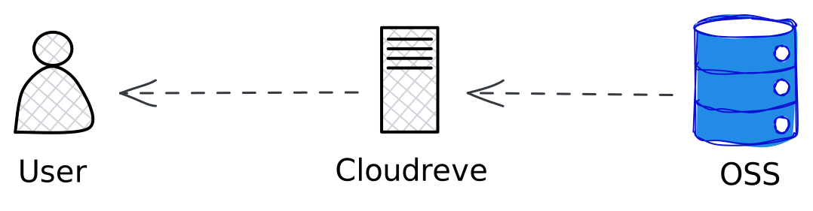

---

title: 'Cloudreve 个人网盘搭建记录'

publishDate: 2025-08-15 23:26:45

description: '基于阿里云 ECS 和 OSS 搭建内网中转的 Cloudreve 个人网盘'

tags:

 - Cloudreve 搭建

heroImage: { src: './thumbnail.png', color: '#353c67' }

language: '中文'

---

当你有闲置的阿里云 ECS 和 OSS 服务时，可以尝试搭建基于 OSS 的内网中转的 Cloudreve 网盘，喜欢折腾的可以尝试一下，将 Cloudreve 部署在阿里云 ECS 上，然后配置 OSS 内网 Endpoint 使用内网流量将 OSS 上的文件先下载到 ECS 上，在通过 ECS 的固定带宽下载的自己的设备上。

这套方案上传是直接本地上传到 OSS，流量免费速度很快，下载的速度很大程度取决于 ECS 的公网带宽，这里我 3M 的带宽下载速度稳定在 400KB/s，速度还可以，不搞大文件日常使用够了，主要是基于内网中转不用流出流量费，性价比高。

## 具体步骤
### 准备 docker 环境
阿里云 ECS 安装 Linux 发行版，我这里安装的是 Alibaba Cloud Linux 3，熟悉命令行的话命令行安装好 docker 和 docker compose 环境，不熟悉命令行其实安装宝塔面板更方便，新机器可以直接在镜像市场选择官方的操作系统➕宝塔面板镜像。

我这里使用面板安装 docker，操作非常简单，登陆宝塔面板，点击左侧导航栏下方左边的菜单显示隐藏设置，docker 默认是隐藏的，点击打开，然后在菜单栏进入 docker 页面，点击安装 docker，等待安装完成 docker 和 docker compose 就安装上了，是不是非常容易。

### 安装 Cloudreve
在面板找到文件菜单栏，在合适的位置新建一个目录，把 Cloudreve 社区版 [docker-compose.yml](https://github.com/cloudreve/Cloudreve/blob/master/docker-compose.yml) 文件上传上去，打开命令行运行 docker compose up -d，等待镜像拉取然后等容器成功起来后，去到 ECS 安全组放行 5212 入端口，然后浏览器输入你的公网 IP+5212 端口就能访问 Cloudreve 了。
配置存储策略

如果 ECS 有空闲的数据盘可以配一个本地存储策略，也就是数据直接存在 ECS 上不用 OSS，但是社区版 Cloudreve 用户组只能配一种存储策略还是挺难受的，一般只能配置两个用户组，一个使用本地存储，另一个使用 OSS 内网中转。

使用阿里云 OSS 的好处是和 ECS 同地域内网访问只需要付存储费用和少量请求费用，大头流量费用可以省也就是这个方案有意义的地方，OSS 存储空间一般有活动买资源包和预留空间有优惠，用不完就可以用来搭个网盘高效利用起来。

策略配置这块还挺简单的，官方文档很清晰，照着做就没问题，注意点就是配置阿里云 OSS 存储策略时先使用公网 Endpoint 创建策略，然后在编辑策略中添加内网 Endpoint 并且打开中转下载，这样上传走直连下载走中转，不用流量费用。

### 配置用户组

新建一个用户组把阿里云 OSS 内网中转存储策略分配给它，然后创建日常使用账号归属这个用户组，关闭网站注册功能，登陆账号测试上传和下载。

### 分配域名

到目前未知只能通过 IP 地址加端口的方式访问，这样不安全最好是分配一个二级域名给他 Cloudreve，这样配上 SSL 证书就能通过 https 访问。

这里我的做法是在阿里云解析 DNS 中在我的个人域名中加上一条解析记录，将这个 cloudreve.teclado.cn 二级域名 A 类型解析到服务器 IP 地址上，然后在宝塔面板网站菜单栏里选择反向代理然后新建一个反向代理项目，将域名 cloudreve.teclado.cn 反向代理到公网 IP:5212 地址就可以。

如果有泛域名证书就直接配置一下，没有也可以很方便的申请一个单域名 CA 证书部署上去。

## 使用感受
受限于资源自己搭建的网盘在空间和速度上其实都远远比不上商业网盘产品，自己搭建的网盘存储空间在 10 到 20GB，速度 400KB/s，空间上比不上百度网盘免费送 1T 空间，速度上 400KB/s 倒比很多网盘快一些，免费网盘的下载速度都在 100KB/s 左右，百度这种可能只有 30KB/s，所以说自己搭建的网盘在空间和速度上还是足够用的，基本工作场景是没问题的，但是如果真有各种备份同步需求，还是花点钱开个网盘年费会员最省事划算，不要折腾自建这个方案了。

所以总结自建网盘最大的优势是数据自控不会但是被和谐，以及资源利用（当你有空闲的 OSS 空间时就可以用来当自己的网盘空间，前提是你有阿里云 ECS），此外对于低需求的用户而言，Cloudreve 网盘提供了链接分享和离线下载等有用的功能，把它当做专门的资源分享器也不错，而且离线下载功能大多数网盘都是会员功能，Cloudreve 免费提供，当做离线下载器用也是好的。

最后，[Cloudreve 官方文档](https://docs.cloudreve.org/zh/)写的很清晰，有动手能力的朋友可以尝试一下，不算太折腾，挺好玩的。