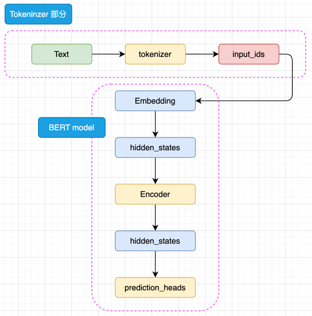
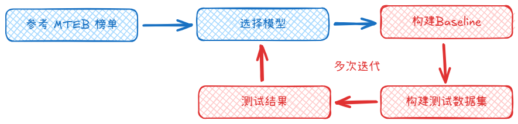

---

title: 理解 embedding（嵌入）

publishDate: 2025-07-04 10:45:00

description: '一种将离散数据映射为连续变量并且能捕获潜在关系的向量化技术'

tags:

 - NLP

heroImage: { src: './thumbnail.png', color: '#98725a' }

language: '中文'

---

## 什么是 embedding

在大模型中，”embedding“指的是将某种类型的输入数据（如文本、图像、声音等）转换成一个稠密的数值向量的过程。这些向量通常包含较多纬度，每一个纬度代表输入数据的某种抽象特征和属性。embedding 的目的是将实际的输入转换为计算机能够更有效处理的向量格式。

在自然语言处理（NLP）中通常使用 embedding 模型将文本数据转换成 embedding 向量，这些 embedding 向量捕获了文本的语义特征，在 embedding 向量空间中，语义相近的实体在向量空间中距离更近，语义不相近的实体在向量空间中距离更远。


由于 embedding 模型有这种精确理解语义的能力，通过对于不同句子段落的语义相似度的计算，embedding 模型可以应用在检索增强生成（RAG）、推荐系统这些领域。

注意：在后面学习 transformer 架构时会发现模型架构中会一个 embedding 层，这里的 embedding 层和 embedding 模型存在差异，核心区别是 embedding 层是服务于生成任务的内部零件，而 embedding 模型是专注于理解的最终完整产品。所以他们的目标、训练方式和优化方向完全不同。

## embedding 的底层

当前主流的上下文嵌入模型（例如 BAAI/bge-large-zh-v1.5）底层基于 BERT 模型，而 BERT 模型是基于 Transformer Encoder-Only 架构。

BERT 是针对于 NLU 任务打造的预训练模型，其输入一般是文本序列，而输出一般是 Label，例如情感分类的积极、消极 Label。但是，正如 Transformer 是一个 Seq2Seq 模型，使用 Encoder 堆叠而成的 BERT 本质上也是一个 Seq2Seq 模型，只是没有加入对特定任务的 Decoder，因此，为适配各种 NLU 任务，在模型的最顶层加入了一个分类头 prediction_heads，用于将多维度的隐藏状态通过线性层转换到分类维度（例如，如果一共有两个类别，prediction_heads 输出的就是两维向量）。

输入的文本序列会首先通过 tokenizer（分词器） 转化成 input_ids（基本每一个模型在 tokenizer 的操作都类似，可以参考 Transformer 的 tokenizer 机制），然后进入 embedding 层转化为特定维度的 hidden_states，再经过 Encoder 块。Encoder 块中是对叠起来的 N 层 Encoder Layer，BERT 有两种规模的模型，分别是 base 版本（12层 Encoder Layer，768 的隐藏层维度，总参数量 110M），large 版本（24层 Encoder Layer，1024 的隐藏层维度，总参数量 340M）。通过 Encoder 编码之后的最顶层 hidden_states 最后经过 prediction_heads 就得到了最后的类别概率，经过 Softmax 计算就可以计算出模型预测的类别。



BERT 更大的创新点在于提出了两个新的预训练任务上——MLM 和 NSP（Next Sentence Prediction，下一句预测），使用了预训练-微调范式将预训练和微调分离，完成一次预训练的模型可以仅通过微调应用在几乎所有下游任务上，所以只要微调的成本足够低，预训练的成本高一点也是有价值的。

MLM 的思路是模拟“完形填空”，在一个文本序列中随机遮蔽部分 token，然后将所有未被遮蔽的 token 输入模型，要求模型根据输入预测被遮蔽的 token。例如，输入和输出可以是：

```
输入：I <MASK> you because you are <MASK>
输出：<MASK> - love; <MASK> - wonderful
```

模型可以利用被遮蔽的 token 的上文和下文一起理解语义来预测被遮蔽的 token，因此通过这样的任务，模型可以拟合双向语义，也就能够更好地实现文本的理解。同样，MLM 任务无需对文本进行任何人为的标注，只需要对文本进行随机遮蔽即可，因此也可以利用互联网所有文本语料实现预训练。例如，BERT 的预训练就使用了足足 3300M 单词的语料。

NSP 的核心思想是针对句级的 NLU 任务，例如问答匹配、自然语言推理等。问答匹配是指，输入一个问题和若干个回答，要求模型找出问题的真正回答；自然语言推理是指，输入一个前提和一个推理，判断推理是否是符合前提的。这样的任务都需要模型在句级去拟合关系，判断两个句子之间的关系，而不仅是 MLM 在 token 级拟合的语义关系。因此，BERT 提出了 NSP 任务来训练模型在句级的语义关系拟合。

NSP 任务的核心思路是要求模型判断一个句对的两个句子是否是连续的上下文。例如，输入和输入可以是：

```
输入：
    Sentence A：I love you.
    Sentence B: Because you are wonderful.
输出：
    1（是连续上下文）

输入：
    Sentence A：I love you.
    Sentence B: Because today's dinner is so nice.
输出：
    0（不是连续上下文）
```

通过要求模型判断句对关系，从而迫使模型拟合句子之间的关系，来适配句级的 NLU 任务。同样，由于 NSP 的正样本可以从无监督语料中随机抽取任意连续的句子，而负样本可以对句子打乱后随机抽取，因此也可以具有几乎无限量的训练数据。

## 如何挑选合适的 embedding

在构建 RAG（检索增强生成） 系统时，需要将用户提问（query）和外部知识库做内容相关性匹配，这里的内容相关性就是通过对 embedding 向量计算得到的，所以 embedding 的好坏决定的上下文的相关性，如果引入不相关的上下文，就会对 LLM 回答问题造成干扰，影响 RAG 系统的性能，所以如何挑选合适的 embedding 模型就是一个关键问题。

HuggingFace 的 **MTEB leaderboard** 是一个一站式的文本 embedding 模型评测榜，当你不知道什么模型适合自己的时候，参考 MTEB 榜单是一个不错的开始，根据项目场景的需求关注特定任务的性能得分，MTEB 包含以下9种任务类型：

- Semantic Textual Similarity (STS) ：确定句子对的相似性。
- Summarization ：评估机器生成的摘要。
- Retrieval ：检索内容相关的文档。
- Reranking ：根据与查询的相关性对结果进行重新排序。
- Bitext Mining ：寻找两种语言句子集之间的最佳匹配。
- Classification ：使用嵌入模型训练逻辑回归分类器。
- Clustering ：将句子或段落分组为有意义的簇。
- Pair Classification ：对文本输入分配二元标签。
- Multilabel Classification: 对文本输入分配多元标签。

除了模型排名外，还需要关注下面这些特性：

- 模型大小：较大模型计算成本大，适合较复杂的任务。
- 嵌入纬度：纬度低存储和比较更快，但是语义捕获能力降低。
- 语言支持：多语言模型在跨语言场景下表现更好，单语言模型在特定语言上表现更好。
- 推理时间：如果对响应速度有要求在需要选择推理速度更快的模型。
- 长文本能力：需要考虑模型对文本块的 token 长度限制，超过限制的文本会被模型截断。
- 成本和可扩展：开源模型免费支持微调，专有模型涉及 token 费用和隐私问题。

另外不推荐使用 LLM 微调的 embedding 模型，这类模型大小过大，并且性能和 BERT 模型差不多，但是计算成本高很多。

但是最近的 Qwen3/Qwen3-Embedding 模型很火，这个模型基于 Qwen3-base 模型训练，属于 LLM 架构，但是采用了混合专家（MoE）架构设计，针对 embedding 任务做了深度优化，虽然单次推理成本比 BERT 模型高，但在大规模检索系统中，Qwen3-Embedding 的高准确率可减少召回次数，综合成本效益反而提升。所以说 Qwen3-Embedding 选择基于LLM架构，并非简单追求模型规模，而是通过平衡精度-成本来完成更好的 embedding 效果，对于简单任务，BERT 仍是高性价比选择；但在需要泛化性、多语言支持或长文本处理的场景，LLM 衍生的嵌入模型也许会变成发展趋势。
 
因为 MTEB 评测数据集是公开的，所以模型通常会基于评测数据进行效果优化，因此 MTEB 的排名和评分更适合作为参考，一般来说选择合适 embedding 模型的流程是根据自己的场景需求参考 MTEB 榜单挑选出一些备选模型，然后构建 baseline 和自己评测的数据集，然后对于 baseline 进行测试，根据测试的结果来选择是否要更换或者优化 embedding 模型，经过反复迭代才能找到适合自己的 embedding 模型。




## embedding 的调用方式

这里选择 Qwen3/Qwen3-Embedding-0.6B 模型来演示，代码来自官方示例。

### transformers 

Qwen3-Embedding 系列模型是指令感知型嵌入模型，所以对于 query 必须要指定 task，而对于 document 则不需要指定 task，get_detailed_instruct()  这个功能函数就是将 query 和 task 绑定；Qwen3 模型处理数据使用了左填充（Left-Padding），序列的最后一个 token 通常都是有效的，在模型推理后最后一个 token 的向量包含整个序列的信息，last_token_pool() 这个功能函数的作用就是获取序列最后一个 token 向量作为最终的 embedding 向量。

```python
# 导入要用到的库
import torch.nn.functional as F
from torch import Tensor
from transformers import AutoTokenizer, AutoModel

# 获取序列中最后一个 token 的推理向量
def last_token_pool(last_hidden_states: Tensor,
                 attention_mask: Tensor) -> Tensor:
    left_padding = (attention_mask[:, -1].sum() == attention_mask.shape[0])
    if left_padding:
        return last_hidden_states[:, -1]
    else:
        sequence_lengths = attention_mask.sum(dim=1) - 1
        batch_size = last_hidden_states.shape[0]
        return last_hidden_states[torch.arange(batch_size, device=last_hidden_states.device), sequence_lengths]

# 构建 task 和 query
def get_detailed_instruct(task_description: str, query: str) -> str:
    return f'Instruct: {task_description}\nQuery:{query}'

# 定义 Task、Query 和 Documents
task = 'Given a web search query, retrieve relevant passages that answer the query'

queries = [
    get_detailed_instruct(task, 'What is the capital of China?'),
    get_detailed_instruct(task, 'Explain gravity')
]

documents = [
    "The capital of China is Beijing.",
    "Gravity is a force that attracts two bodies towards each other. It gives weight to physical objects and is responsible for the movement of planets around the sun."
]
input_texts = queries + documents

# 加载模型和分词器
tokenizer = AutoTokenizer.from_pretrained('Qwen/Qwen3-Embedding-0.6B', padding_side='left')
model = AutoModel.from_pretrained('Qwen/Qwen3-Embedding-0.6B')

max_length = 8192

# 对输入文本进行分词
batch_dict = tokenizer(
    input_texts,
    padding=True,
    truncation=True,
    max_length=max_length,
    return_tensors="pt",
)
batch_dict.to(model.device)

# embedding
outputs = model(**batch_dict)
embeddings = last_token_pool(outputs.last_hidden_state, batch_dict['attention_mask'])

# normalize embeddings
embeddings = F.normalize(embeddings, p=2, dim=1)
scores = (embeddings[:2] @ embeddings[2:].T)
print(scores.tolist())
# [[0.7645568251609802, 0.14142508804798126], [0.13549736142158508, 0.5999549627304077]]
```

### sentence-transformers

sentence-transformers 是 huggingface 推出的专门处理嵌入任务的 python 库，使用 sentence-transformers 可以减少很多工作，简化代码提高效率。

```python
from sentence_transformers import SentenceTransformer

# Load the model
model = SentenceTransformer("Qwen/Qwen3-Embedding-0.6B")

# The queries and documents to embed
queries = [
    "What is the capital of China?",
    "Explain gravity",
]
documents = [
    "The capital of China is Beijing.",
    "Gravity is a force that attracts two bodies towards each other. It gives weight to physical objects and is responsible for the movement of planets around the sun.",
]

# prompt_name 可以控制 task
query_embeddings = model.encode(queries, prompt_name="query")
document_embeddings = model.encode(documents)

# Compute the (cosine) similarity between the query and document embeddings
similarity = model.similarity(query_embeddings, document_embeddings)
print(similarity)
# tensor([[0.7646, 0.1414],
#         [0.1355, 0.6000]])
```


