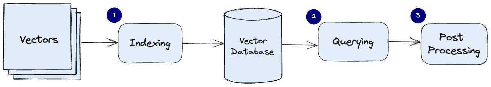
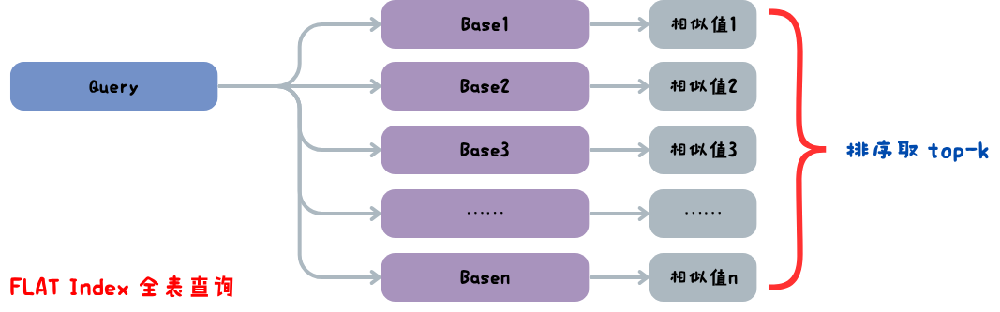
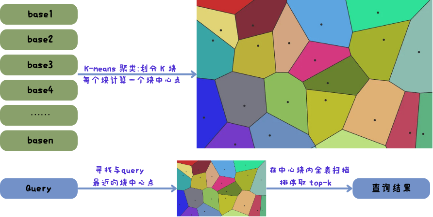
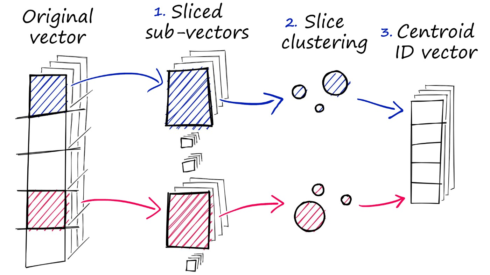
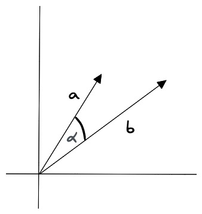
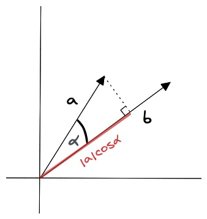
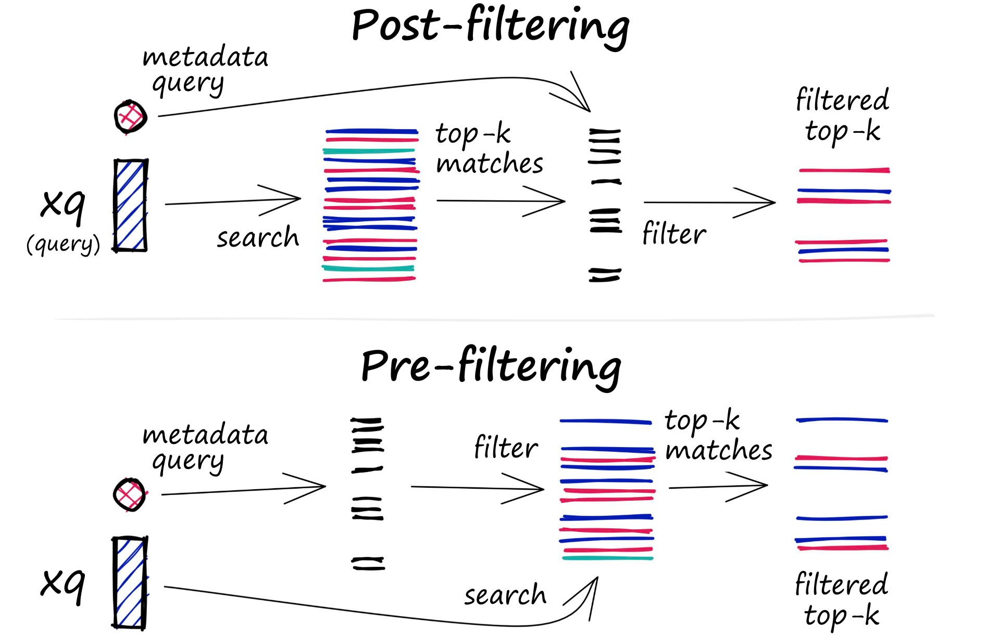
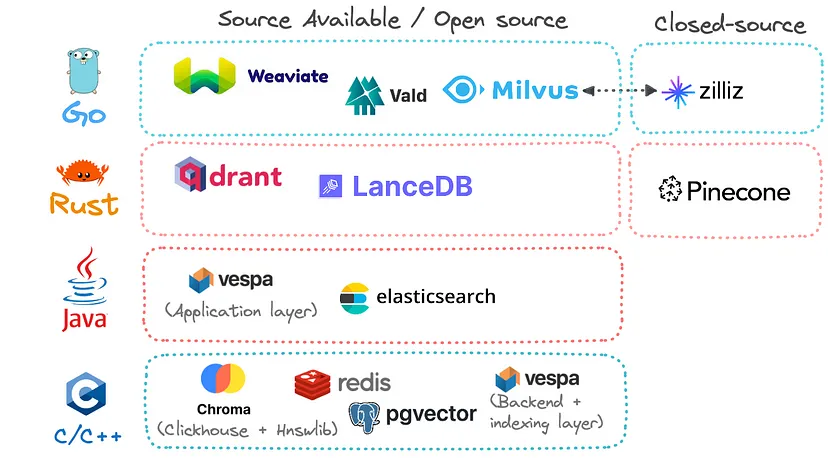

---

title: 向量数据库和索引技术

publishDate: 2025-07-07 15:15:00

description: '解析向量数据库工作原理、索引算法及选型指南'

tags:

 - vector database
 - vector index

heroImage: { src: './thumbnail.png', color: '#42555f' }

language: '中文'
---
在之前介绍过了什么是 embedding 以及在构建 RAG 系统时如何选择合适的 embedding 模型，当我们将原始数据嵌入成 embedding 向量后，为了能重复使用这些向量数据，我们就需要一个专门用于向量存储的数据库——向量数据库（vector database）。

## 什么是向量数据库

向量数据库是一种专门用于存储、索引和查询向量数据的数据库系统，它与其他传统数据库的核心差异在于数据表示方式和查询逻辑。

|   特性   |             传统数据库             |        向量数据库        |
| :------: | :--------------------------------: | :----------------------: |
| 数据存储 | 结构化数据（数值、字符串、日期等） |  高维向量（浮点型数组）  |
| 查询方式 | 精确匹配（如 where name = 'cat'）  |        相似性搜索        |
| 索引方式 |         B+ 树、哈希索引等          | ANN 索引（如 HNSW、IVF） |

对于向量数据库存在一个普遍的误解，认为向量数据库只是对于近似最近邻（ANN）搜索算法的封装，从本质上来说向量数据库是对向量数据管理和查询的一个综合解决方案，比起单独的构建向量索引的工具，向量数据库在云原生、多租户、可扩展性以及安全措施上有着更多的功能。

## 向量数据库的工作原理

在传统数据库中，查询需要返回数据表中所有符合匹配条件的数据，而在向量数据库中，查询是通过计算向量数据之间的相似性度量，来返回与查询向量最接近的向量数据，向量数据库使用的查询算法都属于是近似最近邻（ANN）算法，由于查询返回的是近似结果，我们主要考虑的是在准确性和查询速度之间进行权衡，结果越准确，查询速度也就越慢，所以需要找到一个准确性和速度平衡的点。

向量数据库的常见工作流程是索引、查询、后处理：

**索引**：向量数据库使用诸如 HNSW、IVF、PG 等算法对向量数据建立索引，这一步操作将向量数据映射成一种能够快速查询的数据结构。

**查询**：向量数据库将索引后的查询向量与数据库中的索引向量比较，找到最近邻向量。

**后处理**：在某些情况下，需要对查询到的最近邻向量进行处理返回最终结果，例如使用不同相似性度量进行重新排序。

## 索引技术分类

基于树的方法对于低维数据非常有效，并且可以提供精确的最近邻搜索。然而，由于“维度诅咒”，它们在高维空间中的性能通常会下降。此外，它们需要大量内存，对于大型数据集效率较低，这会导致构建时间更长和延迟更高。

量化方法在内存利用上效率较高，通过将向量压缩为紧凑的代码来实现快速搜索。但是，这种压缩可能会导致信息丢失，从而降低搜索准确性。另外，这些方法在训练阶段的计算成本较高，会增加构建时间。

哈希方法速度快且相对节省内存，它将相似的向量映射到同一个哈希桶中。在处理高维数据和大规模数据集时表现良好，具有较高的吞吐量。然而，由于哈希冲突可能会导致误报和漏报，从而降低搜索结果的质量。选择合适数量的哈希函数和哈希表至关重要，因为它们会显著影响性能。

聚类方法可以通过将搜索空间缩小到特定的聚类来加快搜索操作，但搜索结果的准确性可能会受到聚类质量的影响。聚类通常是一个批处理过程，这意味着它不太适合不断添加新向量的动态数据，因为这会导致频繁的重新索引。

基于图的方法在准确性和速度之间取得了较好的平衡。它们对高维数据很有效，并且可以提供高质量的搜索结果。但是，由于需要存储图结构，它们可能会占用大量内存，而且图的构建在计算上也很昂贵。

向量数据库中算法的选择取决于任务的具体要求，包括数据集的大小和维度、可用的计算资源，以及在准确性和效率之间可接受的权衡。许多现代向量数据库使用混合方法，结合不同方法的优点来实现高速和高精度。如果希望充分发挥向量数据库性能，就必须要更加了解这些算法。

## 索引算法

### FLAT Index

FLAT Index 也称全表扫描，它不会对向量数据做任何修改，直接对数据库中的全部向量数据做相似性计算，返回 top-k 个近似值。全表扫描的搜索准确度可以说是 100%，但是搜索速度可是说是 0%，所以我们要采用近似最近邻（ANN）搜索，来找到一个准确度和速度的平衡。

### IVF Index

IVF（Inverted File Index）倒排文件索引，用 K-means 算法将所有向量分成 k 个块，每个块有一个块中心向量，为每个块内部建立倒排索引。当 Query 查询向量时先与各个块中心向量比较，找出与 Query 最近的 n 个块（如 5），然后只搜索这些块里的向量。通过聚类划分区域来缩小查询范围，可以牺牲少量精度，大大提升查询速度。

### HNSW index
HNSW（Hierarchical Navigable Small World）的核心思想是通过构建一个分层的图结构来实现高效的近似最近邻搜索，所以首先需要分层（例如分 3 层），然后确定每层的数据数量，layer0 层是全部数据，从 layer0 层中随机抽取一部分数据到 layer1 层，layer2 层则从下一层 layer1 层中抽取一部分数据，为每一层的数据建立 k 近邻图结构。搜索时从顶层开始，找到与查询向量最接近的节点，然后逐层向下，在更精细的图中进行搜索，直到最底层。

### PG 
PG（Product Quantization）量化乘积是一种高效的向量压缩技术，核心思想是将高维向量空间分解成多个低维子空间，然后对每个子空间进行聚类生成码本，每个子空间用聚类中心的索引来表示，原始向量压缩为低维子空间索引的组合。使用量化乘积可以大大降低内存占用（压缩率可达 10-100 倍），提高查询速度，量化过程会损失部分信息，所以需要平衡速度和精度。PQ 常与其他索引技术（如IVF）结合使用，形成 IVF-PQ 混合索引，在精度和效率间取得更好平衡。

## 相似性度量

在相似性搜索中，需要计算两个向量之间的距离，然后根据距离来判断它们的相似度。关于如何计算向量在高维空间中距离，常见的向量相似度算法有欧几里得距离、余弦相似度、点积相似度。

### 欧几里得距离

欧几里得距离是指两个向量之间的直线距离，它的计算公式为：
$$
d(\mathbf{A}, \mathbf{B})=\sqrt{\sum_{i=1}^{n}\left(A_{i}-B_{i}\right)^{2}}
$$
其中，$A$ 和 $B$ 分别表示两个向量，$n$ 表示向量的维度。

### 余弦相似度

余弦相似度是指两个向量之间的夹角余弦值，它的计算公式为：

$$
\text{cosine}(A,B) = \frac{\mathbf{A} \cdot \mathbf{B}}{|\mathbf{A}| |\mathbf{B}|}
$$
其中，$A$ 和 $B$ 分别表示两个向量，$\cdot$ 表示向量的点积，$|A|$ 和 $|B|$ 分别表示两个向量的模长。

### 点积相似度

向量的点积相似度是指两个向量之间的点积值，它的计算公式为：
$$
\text{dot}(A,B) = \mathbf{A} \cdot \mathbf{B} = \sum_{i=1}^{n} A_i B_i
$$
其中，$A$ 和 $B$ 分别表示两个向量，$n$ 表示向量的维度。

## 过滤（filtering）
在实际的业务场景中，往往不需要在整个向量数据库中进行相似性搜索，而是通过部分的业务字段进行过滤再进行查询。所以存储在数据库的向量往往还需要包含元数据，例如用户 ID、文档 ID 等信息。这样就可以在搜索的时候，根据元数据来过滤搜索结果，从而得到最终的结果。

为此，向量数据库通常维护两个索引：一个是向量索引，另一个是元数据索引。

过滤过程可以在向量搜索本身之前或之后执行，但每种方法都有自己的挑战，可能会影响查询性能：

- Pre-filtering：在向量搜索之前进行元数据过滤。虽然这可以帮助减少搜索空间，但是元数据过滤可能会过滤掉和结果相关的数据。
- Post-filtering：在向量搜索完成后进行元数据过滤。考虑全部数据之后进行元数据过滤会增加很多开销，并且减慢查询速度。

为了优化过滤流程，向量数据库使用各种技术，例如利用先进的索引方法来处理元数据或使用并行处理来加速过滤任务。平衡搜索性能和筛选精度之间的权衡对于提供高效且相关的向量数据库查询结果至关重要。

## 热门的向量数据库

## 如何选择向量数据库

如何选择向量数据库因具体项目需求、预算限制和个人偏好而异，下面是一些比较通用的结论：

- 如果需要开源、可自托管且功能全面，可以选择 Milvus 或 Weaviate
- 如果希望快速使用且不想管理基础设施，可以选择 Pinecone
- 如果注重性能和内存效率，可以考虑 Qdrant
- 如果项目需要与 LangChain 等框架集成，且希望轻量级，Chroma 是一个不错的选择

## References

[https://guangzhengli.com/blog/zh/vector-database](https://guangzhengli.com/blog/zh/vector-database)

[https://zhuanlan.zhihu.com/p/27399676042](https://zhuanlan.zhihu.com/p/27399676042)

